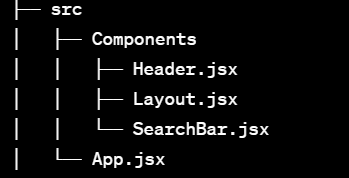

# PicEyes

PicEyes is an image search application that allows users to search for images using the Flickr API. Users can search for images, view suggestions, and see the search history, providing a user-friendly experience for browsing images.

🔗[Deployed Link](https://ori-task.vercel.app/)


https://github.com/suryanshsingh2001/ORI-Task/assets/80690023/c8e4654a-2e23-49e6-98db-50cef40de9cc


## Important Note
I want to highlight that the Flickr API's `flickr.photos.getRecent` method currently lacks support for the `safe_search` parameter. This may lead to the display of potentially sensitive or explicit content. I have tried to mitigate this issue by using the `safe_search` parameter in the `flickr.photos.search` method, but this does not guarantee that all images will be safe for work.

## Task List

- [x] **Search Bar**: Users can search for images using the search bar.
- [x] **Suggestions**: The application provides search suggestions based on previous search history.
- [x] **Recent Photos**: Users can view recent photos fetched from the Flickr API.
- [x] **Search History**: Users can see their search history and click on previous search terms to perform a new search.
- [x] **Clear Suggestions**: Users can clear the search history and suggestions with a single click.
- [x] **Infinite Scroll**: The application provides an infinite scroll feature to display more search results as the user scrolls down.
- [x] **Modal Preview**: Clicking on an image in the search results opens a modal to view the image in detail.

## Bonus Tasks
- [x] **Debounce**: The search input is debounced to prevent unnecessary API calls.'
- [x] **Responsive Design**: The application is responsive and works well on mobile devices.
- [x] **Loading Indicator**: The application displays a loading indicator while fetching data from the Flickr API.
- [x] **Fixed Search Bar**: The search bar is fixed at the top of the page for easy access.
- [x] **View on Flickr**: The button takes the user to the Flickr page for the selected image.
- [x] **Deployed**: The application is deployed on Vercel for easy access.


## Technologies Used

- **React:** Used for building the user interface and managing the application state.
- **Axios:** Utilized for making HTTP requests to the Flickr API and fetching image data.
- **Tailwind CSS:** Employed for styling the user interface and creating an attractive design.
- **react-modal:** Implemented to create a modal for displaying a larger view of the selected image.
- **Vite:** Used as the build tool and development server for rapid development.
- **Flickr API:** Integrated to fetch image data and provide search functionality.
- **lodash:** Utilized for debouncing the search input and managing search history efficiently.
- **Vercel:** Deployed the application on Vercel for hosting and managing live deployment.

## Components Structure




## Getting Started

To get started with the project, follow these steps:

1. Clone the repository.
2. Run `npm install` to install the necessary dependencies.
3. Create a .env file with the following variable: 

```
VITE_REACT_APP_FLICKR_API_KEY=your_api_key_here
```
4. Start the development server using `npm run dev`.
5. Open the application in your browser at `localhost:5173`

-----------------
Made by Suryansh Singh

tashusingh2001@gmail.com

[LinkedIn](https://www.linkedin.com/in/suryanshsingh2001/)

[Portfolio](https://suryansh-portfolio.onrender.com/)
